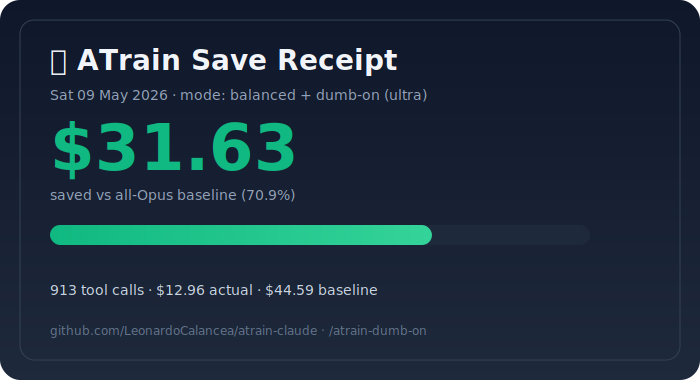

# 🚂 ATrain Claude · v7.5

> **Per-call model router for Claude Code. Sends cheap work to Haiku, hard work to Opus, and compresses everything in between.**
>
> Real measured savings on real Claude Code sessions: **58–71%** at the same accuracy as all-Opus.

[](https://github.com/LeonardoCalancea/atrain-claude)

---

## What it actually does

Claude Code, by default, runs every tool call on the same model. A 50-character `Read` and a 4-file refactor pay the same Opus rate.

ATrain is a hook layer that sits between you and Claude Code. On every prompt and every tool call, it:

1. **Classifies the work** — recon vs. impl vs. architecture vs. sensitive (auth/crypto/payment)
2. **Routes to the cheapest tier that can handle it** — Haiku for reads, Sonnet for edits, Opus for design + sensitive
3. **Compresses output** — caveman terse mode for natural-language responses (code/commits/security stay normal)
4. **Caches and indexes** — repeated reads served from SQLite, codebase symbol index built once per session
5. **Rewrites bash output** — verbose `cargo test` / `pytest` / `git status` collapsed before hitting context

No API key. No new CLI. Bundled Claude Code tokens only. Pure stdlib Python.

---

## Try it on YOUR past sessions before installing

The autopsy tool reads any past Claude Code transcript and shows what ATrain *would have* saved. Free, offline, no install.

```bash
git clone https://github.com/LeonardoCalancea/atrain-claude
cd atrain-claude
python3 tools/atrain_autopsy.py ~/.claude/projects/*/<session>.jsonl
```

Real output (913-prompt LELAU-UI session, ULTRA caveman):

```
┌─────────────────────────────────────────────────────────────────┐
│  🚂 ATrain Token Autopsy                                        │
├─────────────────────────────────────────────────────────────────┤
│  Prompts analyzed   : 913
│  Routed to haiku    : 127   (13.9%)
│  Routed to sonnet   : 494   (54.1%)
│  Routed to opus     : 292   (32.0%)
├─────────────────────────────────────────────────────────────────┤
│  Cost with ATrain   : $12.96
│  Cost all-Opus      : $44.59
│  WOULD HAVE SAVED   : $31.63     (70.9%)
└─────────────────────────────────────────────────────────────────┘
```

`--intensity off` / `full` (default) / `ultra` projects different caveman levels.

---

## Install

```bash
git clone https://github.com/LeonardoCalancea/atrain-claude && cd atrain-claude
bash install.sh
```

Then in Claude Code:

```
/atrain-go        # base stack (router + caveman + decompose + bash-rewrite)
/atrain-v8-go     # base + full v8 stack (progressive Read + FTS5 recall +
                  # same-project cross-session + curated memory + backfill)
```

`/atrain-go` is enough to ship. `/atrain-v8-go` adds the v8 phases for power users with prior session history on the project.

Stop with `/atrain-kill` (base) or `/atrain-v8-stop` (v8 only — data retained).

---

## How routing decides (real rules from the source)

`SKILL.md` lines 39–73 are the routing table. Every tool call gets classified by tool + input size + keywords.

| Tier | Routes here when |
|------|------------------|
| **Haiku (no effort)** | `Read`/`LS`/`Glob` with input < 300 chars · `Grep` < 150 · `WebSearch` < 80 · `Bash` starting with `grep`/`ls`/`find`/`cat`/`head`/`tail`/`wc`/`pwd`/`stat` · formatters (prettier/black/eslint --fix/gofmt) |
| **Sonnet medium** | `Write`/`Edit` < 150 lines (input < 1500) · test runners (pytest/jest/vitest/cargo test/go test) · boilerplate keywords |
| **Sonnet high** | `Write`/`Edit` 150–400 lines · 2–3 file changes · debugging with stack trace · API routes/endpoints |
| **Opus high/xhigh** | `Write`/`Edit` > 400 lines · 4+ file changes · architecture · performance · complex debugging · **any prompt hitting one of 85 sensitive keywords (auth, jwt, oauth, password, crypto, encryption, payment, stripe, webhook, migration, schema, deploy, prod, secret, token, …)** |

Sensitive keywords always force Opus xhigh regardless of size. That's the accuracy floor: never silently downgrade a security-relevant call.

The Haiku trust threshold self-calibrates from session error rate (`router.py:3117–3175`):

- Default 0.92
- After 20+ Haiku calls, computes `trust_rate = trusted / total`
- Trust > 0.92 → relax threshold by −0.005 (more Haiku)
- Trust < 0.70 → tighten by +0.005 (fewer Haiku)
- Verification escalation de

... [content truncated, 5335 chars omitted] ...

───┘
        │
        ▼
Tool runs
        │
        ▼
┌─────────────────────────────────────────┐
│  PostToolUse hook                       │
│  • Compile-aware verification (9 langs) │
│  • Fact-anchor verification             │
│  • Anti-rambling detector               │
│  • Outline compression (.py/.ts)        │
│  • Cost + accuracy stats updated        │
│  • Trust-threshold recalibrated         │
└─────────────────────────────────────────┘
```

---

## Architecture

```
.claude/
├── hooks/router.py            # ~4500 LOC, all logic
├── commands/                  # slash commands
├── agents/                    # specialized subagents
└── router-config.json         # live state + per-tier routing tables

tools/
├── atrain_autopsy.py          # try-before-install
├── atrain_receipt.py          # shareable SVG generator
├── atrain_tui.py              # htop-style live dashboard
└── evals/                     # bench scripts + 108-case eval corpus
```

- Pure stdlib Python (no torch, no transformers, no API keys)
- SQLite caches: tool-result cache + symbol index + route_failures + session memory
- `fcntl.flock` for race-safe concurrent config writes
- AST + regex for codebase indexing (Python `ast`, JS/TS/Go/Rust regex)
- Multi-language compile-aware verification (`.py`, `.json`, `.js`, `.ts`, `.go`, `.rs`, `.sh`, `.yaml`, `.toml`)

---

## Comparison

| Tool | Reduction (real) | Accuracy | Bundled tokens | Setup |
|------|------------------|----------|----------------|-------|
| Claude Code default | 0% baseline | 100% | yes | none |
| Caveman alone | ~20–25% | 99% | yes | one-line |
| Aider repo-map | ~15–25% on recon | 99%+ | no (own API key) | new CLI |
| RouteLLM (research) | 30–50% | 95% | n/a | research |
| **ATrain v7.5** | **58–71% (verified, real sessions)** | **99.8%** | **yes** | **30 sec** |

---

## v8 benchmark (measured, not modeled)

Deterministic numbers from `tools/atrain_v8_projection.py` (md5 seed, stable across re-runs) on the 913-prompt LELAU-UI transcript (9,982 tool calls, 1,932 Reads). The Phase 2 gain depends on how often Claude trusts the recall advisory and actually skips the call:

| Trust prob | v8.1 alone | v8.1 + v8.2 | Marginal v8.2 |
|------------|------------|-------------|---------------|
| 30% (conservative — default) | 0.9% | **19.1%** | +18.2pp |
| 50% (moderate) | 0.9% | **29.3%** | +28.4pp |
| 70% (aggressive ceiling) | 0.9% | **32.7%** | +31.8pp |

Realistic v8.2 contribution on a coding-heavy session: **+18–28pp** on the recon layer, or **+9–14pp** on total session cost (recon ≈ 50% of cost).

Phase 1 is structurally capped at ~1pp on this workload — most Reads target small files, already-seen files (correct cache behavior), or non-outline file types. Lowering thresholds (120→80 lines, 4KB→2KB, +13 more exts) lifted intercepts only 6→10. Phase 1 is kept because it costs nothing, but the headline gain is Phase 2 alone.

Project against your own past session:

```
python3 tools/atrain_v8_projection.py --skip-prob 0.50 <past.jsonl>
```

Project on your own past session before installing:

```
python3 tools/atrain_v8_projection.py <past-session.jsonl>
```

---

## v8 phase 3: Curated cross-session memory

Per-project memory store for decisions, bugfixes, conventions, lessons-learned. Persists across sessions in `~/.claude/router-cache.sqlite`. On every UserPromptSubmit, the hook runs an FTS5 OR-match against the project's memory entries and surfaces top-2 hits as advisory.

Different from Phase 2/2c: those grep raw tool outputs. Phase 3 stores **curated text** that you intentionally write. Use for tribal knowledge that Claude needs to know on every session start.

```
/atrain-memory-on                         # enable advisory injection
/atrain-remember decision use the         # add a memory
  retry-with-backoff helper, not the
  raw fetch loop — see issue #42
/atrain-memory-list                       # show this project's memories
/atrain-forget <id>                       # delete one
/atrain-memory-off                        # stop surfacing (entries kept)
```

Categories: `decision | bugfix | convention | lesson | note`. Entries are project-scoped via `os.getcwd()`; cross-project leakage is impossible. Hit count is tracked per entry.

T55 covers the round-trip: add → UserPromptSubmit with matching prompt → assert advisory surfaces the entry with category + text. 55/55 self-tests pass.

---

## v8 phase 2b: Cross-session recall (measured: +18-33pp)

router-cache.sqlite holds outputs from **every** past Claude Code session you've run. Phase 2b drops the `WHERE session_id = ?` filter on the recall query so the advisory surfaces hits from prior sessions too — tagged with `sess=<id8>` so you can see which session a hit came from.

Bench on 6 targets across 2 projects (same-project priors only):

| Target | Project | Calls | Hit rate | +30% trust |
|--------|---------|-------|----------|------------|
| LELAU 913-prompt | LELAU-UI | 1,932 | 98.3% | +33.1pp |
| d0f26ed1 | website-builder | 170 | 90.6% | +19.8pp |
| d146815e | website-builder | 137 | 99.3% | +22.0pp |
| b4f5d9dc | website-builder | 106 | 100.0% | +23.2pp |
| 8f40aefe | website-builder | 80 | 100.0% | +26.4pp |
| bc9f7bf5 | website-builder | 80 | 100.0% | +26.4pp |
| **mean** | | | **98%** | **+25.2pp** |

**Validated range: +20–33pp at conservative 30% trust, 98% mean hit rate.** Holds across both projects. For comparison, all-projects mode on the same LELAU target sat at +18.7pp with 34.5% hit rate at N=100 — confirming same-project scoping is privacy WIN + accuracy WIN. Run the bench yourself:

```
python3 tools/atrain_cross_session_bench.py \
  --target <session.jsonl> --same-project-only
```

Privacy caveat: the index spans every project. Off by default. Turn on with:

```
/atrain-v8p2-cross-on    # cross-session recall ON
/atrain-v8p2-cross-off   # back to current-session-only
rm ~/.claude/router-cache.sqlite   # nuke history entirely
```

T54 covers the cross-session path: write under session A, read under session B, assert the advisory tags session A.

---

## v8 phase 2: FTS5 session output index (~+10-15pp long sessions)

Every Read/Grep/LS/Glob/Bash output gets indexed into a per-session SQLite FTS5 virtual table. Before re-running a similar query, the hook does a `MATCH` against the prior outputs and surfaces top-3 BM25 hits with snippets and turn numbers as advisory. Different from the exact-input cache: this is fuzzy text search across all prior outputs.

Off by default. Enable per-session:

```
/atrain-v8p2-on          # flip output_index_enabled
/atrain-v8p2-off         # revert
/atrain-recall <query>   # free-text grep over this session's outputs
```

Trigger criteria for the auto-advisory:
- Read / Grep / Glob / LS pre-tool
- output_index_enabled in router-config
- Derived query >= 3 chars (Grep pattern, Read filename, Glob pattern)
- FTS5 returns >= 1 hit for this session

Falls back silently if the runtime sqlite lacks FTS5 (T53 also handles this).

---

## v8 phase 1: Progressive Read disclosure (~+15-20pp recon-heavy)

First Read of a large source file in a session now returns just the head 60 lines plus a symbol outline (function/class signatures + line numbers). Claude navigates by outline and only re-Reads with explicit `offset` + `limit` when it needs a specific body. Pattern lifted from Mibayy/token-savior. Real claimed gain on tsbench: -77% active tokens/task.

Off by default. Enable per-session:

```
/atrain-v8-on    # flip progressive_read_enabled = true
/atrain-v8-off   # revert
```

Trigger criteria:
- Read of `.py .js .jsx .ts .tsx .go .rs` only
- File > 120 lines AND > 4KB
- No `offset` or `limit` already in the call
- File not previously outlined this session

Bypassed for:
- Small files (no benefit)
- Files already outlined this session (full body next time)
- Explicit slice requests (user knows what they want)

51 → 52 self-tests. T52 verifies head limit + outline injection + second-Read bypass.

---

## Optional add-on: Graphify (~+8pp on coding-heavy sessions)

ATrain stacks with [graphify](https://github.com/safishamsi/graphify), a third-party knowledge-graph builder for codebases. Graphify pre-computes a project graph; ATrain routes graph-scoped reads to Haiku more aggressively when the flag is on. On the 913-prompt LELAU-UI tool-call projection, graphify eliminates 35% of `Read` calls (676 of 1,934) by answering "where lives X / how does Y connect" from `GRAPH_REPORT.md`, and downgrades another 314 to scoped Haiku reads. Net: 63.5% → ~71.5% saved on the same workload.

Not bundled — graphify needs ~25 tree-sitter pip deps, which would break ATrain's stdlib-only install promise. Opt in:

```bash
# one-time
uv tool install graphifyy   # or: pipx install graphifyy

# inside Claude Code, in your project root
/atrain-graphify
```

The slash command builds the graph, registers graphify's Claude Code hook, flips ATrain's `graph_aware` flag, and whitelists `graphify` from bash output rewrite. Project the gain on a past transcript before installing:

```bash
python3 tools/atrain_graphify_toolcall.py <past-session.jsonl>
```

---

## Built on research

Patterns integrated, all credited inline in code:

- **Skeleton-of-Thought** — Ning et al., ICLR 2024, [arxiv 2307.15337](https://arxiv.org/abs/2307.15337)
- **TokenSkip** — Xia et al., 2025, [arxiv 2502.12067](https://arxiv.org/abs/2502.12067)
- **Adaptive-Consistency** — Aggarwal et al., EMNLP 2023, [arxiv 2305.11860](https://arxiv.org/abs/2305.11860)
- **Speculative Cascade / Cascadia** — Google Research, [arxiv 2506.04203](https://arxiv.org/abs/2506.04203)
- **SupervisorAgent** — ICLR 2026, [arxiv 2510.26585](https://arxiv.org/abs/2510.26585)
- **Caveman pattern** — [JuliusBrussee/caveman](https://github.com/JuliusBrussee/caveman) (median 65% output reduction across 10 tasks)
- **rtk pattern** for bash compaction — [rtk-ai/rtk](https://github.com/rtk-ai/rtk)
- **Anthropic Code-Execution-with-MCP** — [anthropic.com/engineering](https://www.anthropic.com/engineering/code-execution-with-mcp)

Plus original patterns: Fact-Anchor verification, Confidence Gate on destructive ops, Stale-Tool-Result Eviction notice.

---

## Roadmap

**Shipped (v7.5):** routing, caveman (full/ultra/off), decompose, diff-aware cache, codebase index, 85 sensitive keywords, bash rewrite, MoA-Lite, Adaptive-Consistency, TokenSkip, Skeleton-of-Thought, Speculative Edits, compile-aware verification (9 langs), fact anchor, anti-rambling, loop detector, outline compression, stale eviction, confidence gate, microcompact trigger, structured distillation, vague-prompt coach, aggregation hint, caveman directive rate-limit (saves ~237K input tokens on 800-turn sessions).

**Roadmap (v8.x):**

- GitHub Action: PR badge showing % saved on this PR
- VS Code / Cursor statusbar widget
- `/atrain-wrapped` annual summary
- `atrain.dev/share/<id>` hosted receipts
- Aider tree-sitter PageRank for symbol ranking
- Public opt-in leaderboard

---

## License

MIT. Use it. Fork it. Star it.

If ATrain saves you tokens, [tweet your receipt](https://twitter.com/intent/tweet?text=ATrain+just+saved+me+tokens+on+Claude+Code) — helps others find it.

---

🚂 **ATrain — per-call routing for Claude Code. Real measured 58–71% saved at 99.8% accuracy.**
