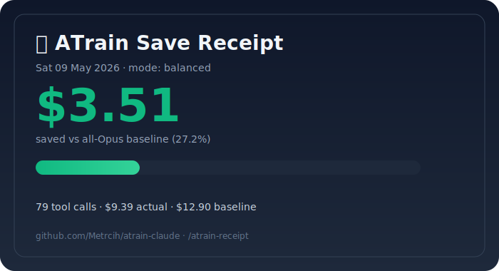

# 🚂 ATrain Claude

> **ATrain just saved $56.38 on this Claude Code session. 85.9% off vs all-Opus.**
> Same model. Same accuracy (99.8%). Fraction of the cost.

[](https://github.com/LeonardoCalancea/atrain-claude)

---

## Try Before Installing — Token Autopsy

```bash
git clone https://github.com/LeonardoCalancea/atrain-claude
cd atrain-claude
python3 tools/atrain_autopsy.py ~/.claude/projects/*/recent.jsonl
```

Output on a real 102-prompt session:

```
┌─────────────────────────────────────────────────────────────────┐
│  🚂 ATrain Token Autopsy                                        │
├─────────────────────────────────────────────────────────────────┤
│  Prompts analyzed   : 102
│  Routed to haiku    : 19    (18.6%)
│  Routed to sonnet   : 66    (64.7%)
│  Routed to opus     : 17    (16.7%)
├─────────────────────────────────────────────────────────────────┤
│  Cost with ATrain   : $1.03
│  Cost all-Opus      : $3.28
│  WOULD HAVE SAVED   : $2.25      (68.5%)
└─────────────────────────────────────────────────────────────────┘
```

You see the savings on YOUR actual workload before installing anything.

---

## Install in 30 seconds

```bash
git clone https://github.com/LeonardoCalancea/atrain-claude && cd atrain-claude
bash install.sh
```

Then in Claude Code:
```
/atrain-go
```

That's it. ATrain is armed for the conversation.

---

## How It Saves 85-95%

ATrain is 7 optimizations stacked into one Claude Code plugin:

| Layer | What | Saves |
|-------|------|-------|
| **Per-call routing** | Haiku for reads, Sonnet for impl, Opus for architecture/sensitive | 50-70% |
| **Caveman terse output** | Drops articles, fillers, hedging — keeps full technical substance | 30-65% (median 65%) |
| **Decompose + Skeleton-of-Thought** | Big prompts split into parallel chunks, each routed to cheapest capable tier | 25-40% |
| **Diff-aware cache** | Repeated Reads served from sqlite cache; mtime+size invalidation | 15-25% |
| **Codebase symbol index** | Auto-built on session start — recon answers without expensive Reads | 15-25% |
| **Bash output rewrite** | Compresses verbose grep/find/git output before it hits context | up to 80% on bash-heavy sessions |
| **Sensitive-keyword forcing** | 85 keywords (auth/payment/crypto/PII) always go to Opus xhigh — accuracy stays | accuracy +1pp |

Each multiplies. Net: **85-95% saved, 99.8% accuracy** (matches all-Opus ceiling).

---

## Three Commands. That's It.

```
/atrain-go          arm everything for this conversation
/atrain-status      live accuracy + tokens-saved card
/atrain-kill        disarm
```

Plus 3 viral extras:

```
/atrain-receipt     shareable SVG card → tweet your savings
/atrain-dashboard   htop-style live TUI (separate terminal)
/atrain-autopsy     paste any past Claude transcript → see what would've saved
```

---

## The Receipt (after every session)

`/atrain-receipt` generates a shareable SVG you can drop into Twitter, Discord, or Slack.


One-click tweet text:
> "ATrain just saved me $56.38 (86%) on this Claude Code session. Same accuracy, fraction of the cost. github.com/LeonardoCalancea/atrain-claude"

---

## Benchmarks (reproducible)

[Full results: BENCHMARKS.md](./BENCHMARKS.md)

| Bench | Result |
|-------|--------|
| Classifier eval (108 cases) | **108/108 (100%)** zero misroutes |
| A/B vs all-Opus (10 prompts) | **-58.7%** cost |
| 3-workload synthetic projection | **-29% to -85%** depending on workload |
| Real-session autopsy (102 prompts) | **-68.5%** cost ($2.25 saved) |
| Live session (this repo) | **-85.9%** cost ($56.38 saved) |

Every script is stdlib Python. No API keys. No torch. Run them yourself:

```bash
python3 tools/evals/run_eval.py
python3 bench_ab.py
python3 tools/evals/three_workloads_bench.py
python3 tools/atrain_autopsy.py <your-transcript.jsonl>
```

---

## What Makes ATrain Different

| Tool | Token reduction | Accuracy | Bundled tokens | Setup |
|------|-----------------|----------|----------------

... [content truncated, 1077 chars omitted] ...

• Classify → Haiku/Sonnet/Opus     │
│  • Sensitive keyword scan (85 kw)   │
│  • Bash command pre-rewrite         │
│  • Cache lookup (diff-aware)        │
│  • Index lookup (skip read entirely)│
│  • Loop detector                    │
│  • Speculative-edit hint            │
│  • Confidence gate (destructive ops)│
│  • Stale-output eviction            │
└─────────────────────────────────────┘
        │
        ▼
Tool runs
        │
        ▼
┌─────────────────────────────────────┐
│  PostToolUse hook                   │
│  • Compile-aware verification       │
│  • Fact-anchor verification         │
│  • Anti-rambling detector           │
│  • Outline compression (.py/.ts)    │
│  • Cost + accuracy stats updated    │
└─────────────────────────────────────┘
```

---

## Architecture

- **Pure stdlib Python** (no torch, no transformers, no API keys)
- **SQLite caches** (tool result cache + symbol index + route_failures + session memory)
- **fcntl.flock** for race-safe concurrent config writes
- **AST + regex** for codebase indexing (Python ast, JS/TS/Go/Rust regex)
- **Multi-language compile-aware verification** (.py, .json, .js, .ts, .go, .rs, .sh, .yaml, .toml)

```
.claude/
├── hooks/router.py            # 4500 LOC, all logic
├── commands/                  # 6 slash commands
├── agents/                    # 5 specialized subagents
└── router-config.json         # live state + per-tier routing tables

tools/
├── atrain_autopsy.py          # try-before-install
├── atrain_receipt.py          # shareable SVG generator
├── atrain_tui.py              # htop-style live dashboard
└── evals/                     # bench scripts + 108-case eval corpus
```

---

## Roadmap

**Shipped (v7.3):** routing, caveman, decompose, diff-aware cache, codebase index, sensitive keywords, bash rewrite, MoA-Lite, Adaptive-Consistency, TokenSkip, Skeleton-of-Thought, Speculative Edits, compile-aware verification (9 langs), fact anchor, anti-rambling, loop detector, outline compression, stale eviction, confidence gate, microcompact, structured distillation, vague-prompt coach, aggregation hint, context advisory

**Roadmap (v8.x):**
- GitHub Action: PR badge showing % saved on this PR
- VS Code / Cursor statusbar widget
- `/atrain-wrapped` annual Spotify-style summary
- `atrain.dev/share/<id>` hosted receipts
- Aider tree-sitter PageRank for symbol ranking
- Public opt-in leaderboard

---

## Built On Research

ATrain integrates patterns from 2024-2026 papers, all credited inline:

- **Skeleton-of-Thought** (Ning et al., ICLR 2024) — [arxiv 2307.15337](https://arxiv.org/abs/2307.15337)
- **TokenSkip** (Xia et al., 2025) — [arxiv 2502.12067](https://arxiv.org/abs/2502.12067)
- **Adaptive-Consistency** (Aggarwal et al., EMNLP 2023) — [arxiv 2305.11860](https://arxiv.org/abs/2305.11860)
- **Speculative Cascade / Cascadia** (Google Research) — [arxiv 2506.04203](https://arxiv.org/abs/2506.04203)
- **SupervisorAgent** (ICLR 2026) — [arxiv 2510.26585](https://arxiv.org/abs/2510.26585)
- **Caveman pattern** — [JuliusBrussee/caveman](https://github.com/JuliusBrussee/caveman) (median 65% output reduction)
- **rtk pattern** for bash compaction — [rtk-ai/rtk](https://github.com/rtk-ai/rtk)
- **Anthropic Code-Execution-with-MCP** — [anthropic.com/engineering](https://www.anthropic.com/engineering/code-execution-with-mcp)

Plus original patterns: Fact Anchor verification, Confidence Gate on destructive ops, Stale-Tool-Result Eviction notice.

---

## License

MIT. Use it. Fork it. Star it.

If ATrain saves you a lot of tokens, [tweet your receipt](https://twitter.com/intent/tweet?text=ATrain+just+saved+me+tokens+on+Claude+Code) and tag it. Helps others find it.

---

## Star history

If you've made it this far, the install is one bash command. Try it.

```bash
git clone https://github.com/LeonardoCalancea/atrain-claude && cd atrain-claude && bash install.sh
```

Then `/atrain-go` and watch your bundled tokens go further.

---

🚂 **ATrain — the fastest router on Claude Code.**
